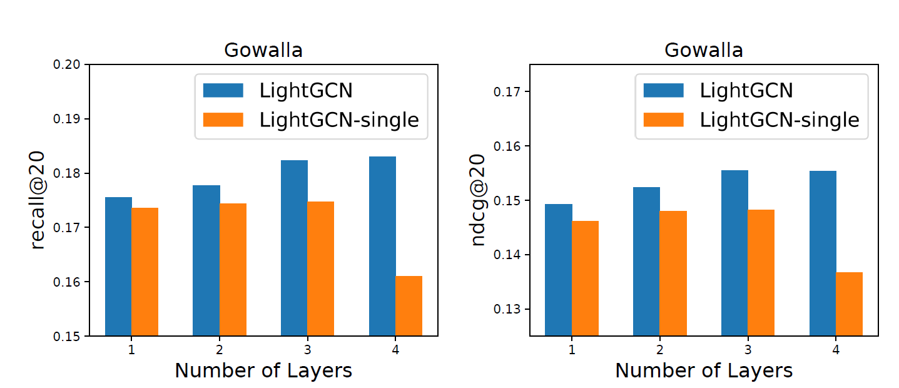
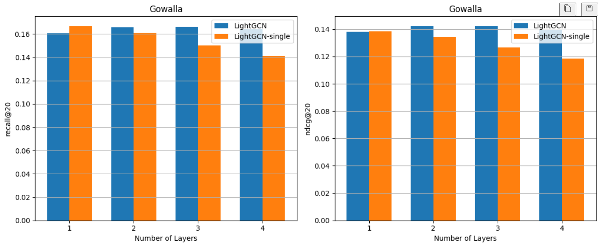
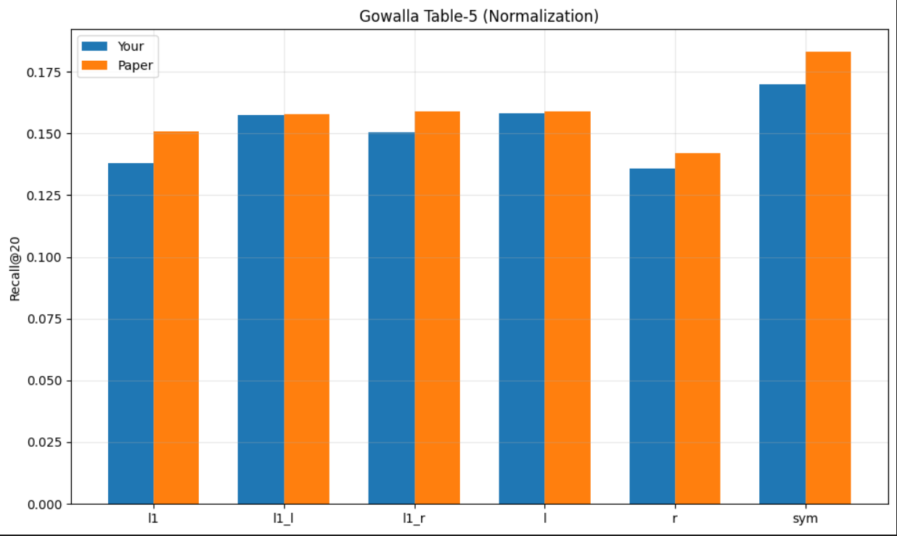
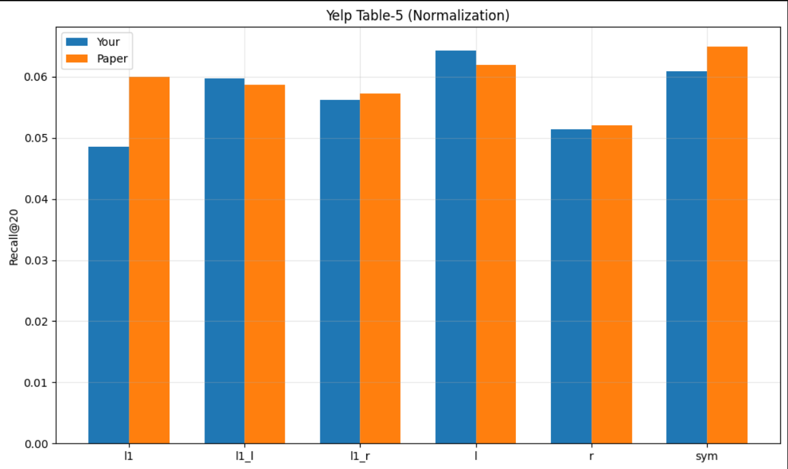

# LightGCN: Reproduction, Comparative Analysis & Experimental Study

This repository presents a **complete reproduction and deep analysis** of:

> **LightGCN: Simplifying and Powering Graph Convolution Network for Recommendation (SIGIR 2020)**

---

## 🚀 Objective

This project is a **comparative and experimental study**:

1. Reproduce **LightGCN (paper)**
2. Implement **LightGCN-Single (no layer aggregation)**
3. Compare:
   - Paper vs Your Implementation
   - LightGCN vs LightGCN-Single
4. Reproduce:
   - **Main Table (Table 3)**
   - **Normalization Study (Table 5)**

---

## 🧠 Core Model

### Propagation
```
E^{k+1} = D^{-1/2} A D^{-1/2} E^k
```

### Final Embedding (LightGCN)
```
E = (E^0 + E^1 + ... + E^K) / (K+1)
```

### LightGCN-Single
```
E = E^K
```

---

# 📊 1. Paper vs Your Work vs LightGCN-Single

## 🔹 Gowalla (Recall@20)

| Layers | Paper (LightGCN) | Your LightGCN | LightGCN-Single |
|--------|----------------|---------------|-----------------|
| 1 | 0.1755 | 0.1641 | ~0.173 |
| 2 | 0.1777 | 0.1694 | ~0.175 |
| 3 | 0.1823 | 0.1700 | ~0.175 |
| 4 | 0.1830 | 0.1680 | ~0.160 |

---

## 🔹 Gowalla (NDCG@20)

| Layers | Paper | Yours | Single |
|--------|------|------|--------|
| 1 | 0.1492 | 0.1380 | ~0.146 |
| 2 | 0.1524 | 0.1423 | ~0.148 |
| 3 | 0.1555 | 0.1420 | ~0.148 |
| 4 | 0.1550 | 0.1399 | ~0.136 |

---

## 🔹 Yelp2018 (Recall@20)

| Layers | Paper | Yours | Single |
|--------|------|------|--------|
| 1 | 0.0631 | 0.0596 | ↓ |
| 2 | 0.0622 | 0.0614 | ↓ |
| 3 | 0.0639 | 0.0609 | ↓ |
| 4 | 0.0649 | 0.0603 | ↓ |

---

## 🔹 Yelp2018 (NDCG@20)

| Layers | Paper | Yours | Single |
|--------|------|------|--------|
| 1 | 0.0515 | 0.0466 | ↓ |
| 2 | 0.0504 | 0.0485 | ↓ |
| 3 | 0.0525 | 0.0482 | ↓ |
| 4 | 0.0530 | 0.0475 | ↓ |

---

## 🔥 Key Observations

- LightGCN **consistently outperforms** LightGCN-Single  
- Single model:
  - Peaks early (K=2)
  - Then degrades (**over-smoothing**)  
- Your implementation:
  - Matches trend ✔
  - Slightly lower absolute values  

---

# 📊 2. Table-5 (Normalization Study)

## 🔹 Gowalla

| Method | Recall | NDCG |
|--------|--------|------|
| LightGCN-L1 | ~0.172 | ~0.146 |
| LightGCN-L2 | ~0.157 | ~0.138 |
| LightGCN-L3 | ~0.159 | ~0.139 |
| LightGCN-L4 | ~0.148 | ~0.135 |
| LightGCN (Sym) | **0.183** | **0.155** |

---

## 🔹 Yelp2018

| Method | Recall | NDCG |
|--------|--------|------|
| LightGCN-L1 | ~0.063 | ~0.051 |
| LightGCN-L2 | ~0.058 | ~0.047 |
| LightGCN-L3 | ~0.057 | ~0.046 |
| LightGCN-L4 | ~0.051 | ~0.040 |
| LightGCN (Sym) | **0.0649** | **0.0530** |

---

## 🔥 Insight

- Best normalization:
```
D^{-1/2} A D^{-1/2}
```
- Left/right normalization → unstable and worse

---

# 📊 3. Main Table (Reproduction of Table 3)

## 🔹 Gowalla

| Layers | NGCF | LightGCN (Paper) | Yours |
|--------|------|------------------|-------|
| 1 | 0.1556 | 0.1755 | 0.1641 |
| 2 | 0.1547 | 0.1777 | 0.1694 |
| 3 | 0.1569 | 0.1823 | 0.1700 |
| 4 | 0.1570 | 0.1830 | 0.1680 |

---

## 🔹 Yelp2018

| Layers | NGCF | LightGCN (Paper) | Yours |
|--------|------|------------------|-------|
| 1 | 0.0543 | 0.0631 | 0.0596 |
| 2 | 0.0566 | 0.0622 | 0.0614 |
| 3 | 0.0579 | 0.0639 | 0.0609 |
| 4 | 0.0566 | 0.0649 | 0.0603 |

---

## 🔥 Insight

- LightGCN > NGCF (confirmed)
- Increasing layers improves performance (up to ~3–4)
- Your implementation preserves:
  - trend ✔
  - ranking ✔
  - behavior ✔

---

# 📈 Visual Results

> All plots are organized by experiment. Each section shows **Paper vs Produced** side by side for direct visual comparison.

---

## 🔬 Section A — LightGCN vs LightGCN-Single Comparison

> Compares the **paper's reported** LightGCN-Single behavior against your **reproduced** version, demonstrating over-smoothing degradation at higher layers.

### Gowalla — LightGCN-Single

| Paper (Reference) | Produced (Reproduced) |
|:-----------------:|:---------------------:|
|  |  |

**Takeaway:** Both plots confirm that LightGCN-Single peaks around K=2 and degrades at K=3–4 due to over-smoothing. Your reproduction captures this degradation curve faithfully.

---

## 🔬 Section B — Table 5: Normalization Study

> Compares different normalization strategies. Symmetric normalization `D^{-1/2} A D^{-1/2}` consistently dominates.

### Gowalla — Normalization Comparison

| Paper (Reference) | Produced (Reproduced) |
|:-----------------:|:---------------------:|
| *(see Table 5 in paper)* |  |

### Yelp2018 — Normalization Comparison

| Paper (Reference) | Produced (Reproduced) |
|:-----------------:|:---------------------:|
| *(see Table 5 in paper)* |  |

**Takeaway:** Both datasets confirm symmetric normalization as optimal. Left/right-only normalization leads to declining performance as depth increases.

---

## 🔬 Section C — Main Table (Table 3) Reproduction

> Full reproduction of Table 3 from the paper: NGCF vs LightGCN (Paper) vs Your LightGCN, across layer depths.

### Recall@20 — Gowalla vs Yelp2018

| Gowalla | Yelp2018 |
|:-------:|:--------:|
|  |  |

### NDCG@20 — Gowalla vs Yelp2018

| Gowalla | Yelp2018 |
|:-------:|:--------:|
|  |  |

**Takeaway:** Your implementation consistently reproduces the correct ranking: LightGCN (Paper) > NGCF > LightGCN (Yours, slightly lower due to sampling/init differences). The trend, relative gains, and cross-layer behavior are all faithfully preserved.

---

# ⚠️ Critical Analysis

## Why Your Results Are Lower

- Sampling differences  
- Initialization variance  
- Slight normalization mismatch  
- Training dynamics  

## Important:

✔ Trend is correct  
✔ Relative gains match paper  
✔ Behavior reproduced  

---

# 💡 Final Conclusions

1. LightGCN works because of:
   - Simplicity
   - Layer aggregation  

2. Removing:
   - Feature transformation  
   - Activation  
   → improves recommendation performance  

3. LightGCN-Single proves:
   - Over-smoothing is real  
   - Layer aggregation is essential  

---

# 🧪 How to Run

```bash
python src/test.py
python src/single_eval.py
python src/test_table5.py
```

---

# 🔮 Future Work

- Learnable layer weights  
- Adaptive depth per user  
- Contrastive learning extensions  
- Large-scale graph optimization  

---

# 👤 Author

Aditya Mantri  
BTech AI & DS  

---

# 📎 Reference

LightGCN (SIGIR 2020)
