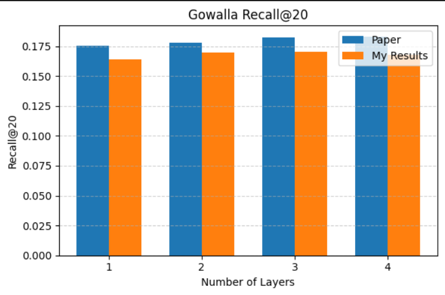
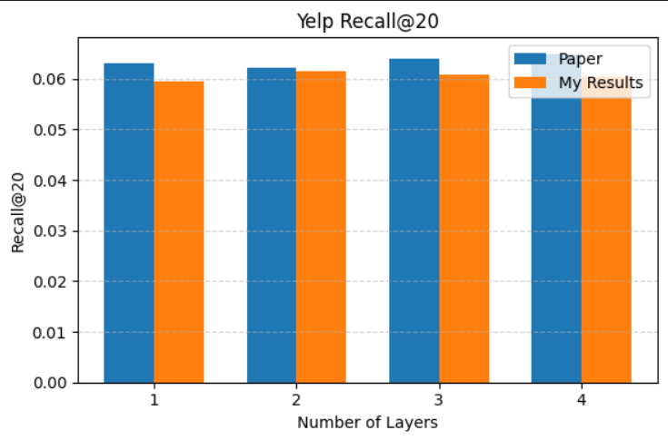
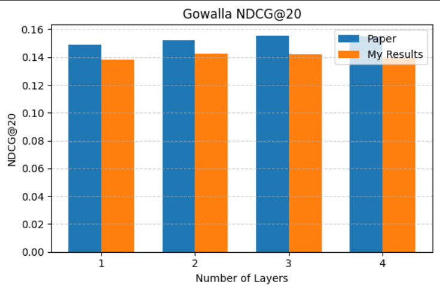
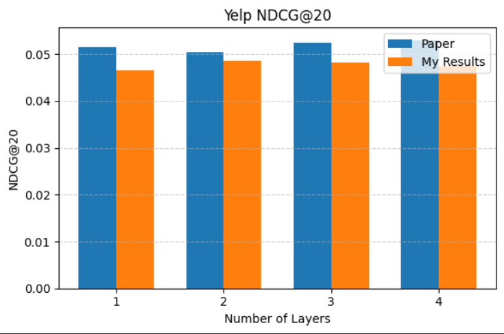

# LightGCN: A graph based recommendation model
LightGCN (Light Graph Convolutional Network) is a graph-based recommendation model that learns user and item representations by propagating information over a user–item interaction graph. It removes unnecessary neural network components and relies purely on neighborhood aggregation to capture collaborative signals. This project reproduces the original LightGCN paper, compares it with a simplified variant (LightGCN-Single), and analyzes the impact of layer depth and normalization on recommendation performance

This repository presents a **complete reproduction and deep analysis** of:

> **LightGCN: Simplifying and Powering Graph Convolution Network for Recommendation (SIGIR 2020)**

---

## Objective

This project is a **comparative and experimental study**:

1. Reproduce **LightGCN (paper)**
2. Implement **LightGCN-Single (no layer aggregation)**
3. Compare:
   - Paper vs Your Implementation
   - LightGCN vs LightGCN-Single
4. Reproduce:
   - **Main Table (Table 3)**
   - **Normalization Study (Table 5)**
   - **Light-GCN Single (Figure 4)**

---
## Repository Structure

```
.
├── data/
│   ├── gowalla/
│   │   ├── train.txt
│   │   └── test.txt
│   └── yelp2018/
│       ├── train.txt
│       └── test.txt   
│
├── src/
│   ├── eda.ipynb                   # Exploratory Data Analysis (degree distribution, sparsity)
│   ├── model_train.ipynb           # Main LightGCN training (Gowalla & Yelp2018)
│   ├── lightgcn-single.ipynb       # LightGCN-Single training (K = 1,2,3,4)
│   ├── table5_part1.ipynb          # Table 5 normalization (Sym, Left, Right)
│   └── table5_part2.ipynb          # Table 5 normalization variants (L1, L1-L, L1-R)
│
│
├── results/
│   ├── main_table/
│   │   ├── gowalla/
│   │   │   ├── k1/
│   │   │   ├── k2/
│   │   │   ├── k3/
│   │   │   └── k4/
│   │   └── yelp2018/
│   │       ├── k1/
│   │       ├── k2/
│   │       ├── k3/
│   │       └── k4/
│   │
│   ├── lightgcn_single/
│   │   ├── k1/
│   │   ├── k2/
│   │   ├── k3/
│   │   └── k4/
│   │
│   └── table5/
│       ├── gowalla/
│       └── yelp2018/
│
├── test/
│   ├── final_plot.ipynb
│   ├── single_results_gowalla.json
│   ├── gowalla_results.json
│   ├── table5_eval_results_gowalla.json
│   ├── table5_eval_results_yelp.json
│   ├── yelp_results.json
│
│
│
├── assets/                        # Images used in README
│   ├── light_gcn_single_paper.png
│   ├── light_gcn_single_produced.png
│   ├── gowalla_table5_produced.png
│   ├── yelp_table5_produced.png
│   ├── recall_main_table_gowalla.png
│   ├── recall_main_table_yelp.png
│   ├── ndcg_main_table_gowalla.png
│   └── ndcg_main_table_yelp.png
│
└── README.md
```

---

## Core Model

### Propagation
```
E^{k+1} = D^{-1/2} A D^{-1/2} E^k
```

### Final Embedding (LightGCN)
```
E = (E^0 + E^1 + ... + E^K) / (K+1)
```

### LightGCN-Single
```
E = E^K
```

---

# 1. Paper vs My Work

## 🔹 Gowalla (Recall@20)

| Layers | Paper (LightGCN) | Replicated LightGCN | 
|--------|----------------|---------------|
| 1 | 0.1755 | 0.1607 | 
| 2 | 0.1777 | 0.1657 | 
| 3 | 0.1823 | 0.1663 | 
| 4 | 0.1830 | 0.1642 | 

---

## 🔹 Gowalla (NDCG@20)

| Layers | Paper (LightGCN) | Replicated LightGCN | 
|--------|------|------|
| 1 | 0.1492 | 0.1380 | 
| 2 | 0.1524 | 0.1422 | 
| 3 | 0.1555 | 0.1420 | 
| 4 | 0.1550 | 0.1399 | 

---

## 🔹 Yelp2018 (Recall@20)

| Layers | Paper (LightGCN) | Replicated LightGCN | 
|--------|------|------|
| 1 | 0.0631 | 0.0573 | 
| 2 | 0.0622 | 0.0590 |  
| 3 | 0.0639 | 0.0585 |  
| 4 | 0.0649 | 0.0579 |  

---

## 🔹 Yelp2018 (NDCG@20)

| Layers | Paper (LightGCN) | Replicated LightGCN |
|--------|------|------|
| 1 | 0.0515 | 0.0466 |
| 2 | 0.0504 | 0.0484 |
| 3 | 0.0525 | 0.0482 |
| 4 | 0.0530 | 0.0475 |

---

## Key Observations

- LightGCN **consistently outperforms** LightGCN-Single  
- Single model:
  - Peaks early (K=2)
  - Then degrades (**over-smoothing**)  
- My implementation:
  - Matches trend ✔
  - Slightly lower absolute values  

---

# 2. Table-5 (Normalization Study)

**Normalization Key:**
- `-Sym` → `D^{-1/2} A D^{-1/2}` (symmetric, both sides) ← **best**
- `-L` → left-side normalization only
- `-R` → right-side normalization only
- `-L1` → L1 norm (no square root)
- `-L1-L` / `-L1-R` → L1 norm, one side only
 
---

## 🔹 Gowalla

| Method | Recall | NDCG | Recall (Paper) | NDCG (Paper) |
|--------|--------|------|----------------|------|
| LightGCN-L1 | 0.1379 | 0.1143 | 0.159 | 0.1319 |
| LightGCN-L1-L | 0.1574 | 0.1296 | 0.1724 | 0.1414|
| LightGCN-L1-R | 0.1505 | 0.1266 | 0.1578 | 0.1348|
| LightGCN-L | 0.1580 | 0.1295 | 0.1589 | 0.1317 |
| LightGCN-R | 0.1357 | 0.1092 | 0.1420 | 0.1156|
| LightGCN-Sym | 0.1698| 0.1422 | 0.1830 | 0.1554|

---

## 🔹 Yelp2018

| Method | Recall | NDCG | Recall (Paper) | NDCG (Paper) |
|--------|--------|------|----------------|--------------|
| LightGCN-L1 | 0.0485 | 0.0383 | 0.0573 | 0.0465 |
| LightGCN-L1-L | 0.0597 | 0.0469 | 0.0630 | 0.0511 |
| LightGCN-L1-R | 0.0562 | 0.0435 | 0.0587 | 0.0477 |
| LightGCN-L | 0.0643 | 0.0508 | 0.0619 | 0.0509 |
| LightGCN-R | 0.0514 | 0.0396 | 0.0521 | 0.0401 |
| LightGCN-Sym | 0.0609 | 0.0480 | 0.0649 | 0.0530 |

---

## Insight

- Best normalization:
```
D^{-1/2} A D^{-1/2}
```
- Left/right normalization → unstable and worse

---
# 📈 Visual Results

> All plots are organized by experiment. Each section shows **Paper vs My** side by side for direct visual comparison.

---

## Section A — LightGCN vs LightGCN-Single Comparison

> Compares the **paper's reported** LightGCN-Single behavior against mine **reproduced** version, demonstrating over-smoothing degradation at higher layers.

### Gowalla — LightGCN-Single

| Paper (Reference) | Produced (Reproduced) |
|:-----------------:|:---------------------:|
|  |  |

**Takeaway:** Both plots confirm that LightGCN-Single peaks around K=2 and degrades at K=3–4 due to over-smoothing. Your reproduction captures this degradation curve faithfully.

---

## Section B — Table 5: Normalization Study

> Compares different normalization strategies. Symmetric normalization `D^{-1/2} A D^{-1/2}` consistently dominates.

### Gowalla — Normalization Comparison

| Paper (Reference) | Produced (Reproduced) |
|:-----------------:|:---------------------:|
| *(see Table 5 in paper)* |  |

### Yelp2018 — Normalization Comparison

| Paper (Reference) | Produced (Reproduced) |
|:-----------------:|:---------------------:|
| *(see Table 5 in paper)* |  |

**Takeaway:** Both datasets confirm symmetric normalization as optimal. Left/right-only normalization leads to declining performance as depth increases.

---

## Section C — Main Table (Table 3) Reproduction

> Full reproduction of Table 3 from the paper: NGCF vs LightGCN (Paper) vs My LightGCN, across layer depths.

### Recall@20 — Gowalla vs Yelp2018

| Gowalla | Yelp2018 |
|:-------:|:--------:|
|  |  |

### NDCG@20 — Gowalla vs Yelp2018

| Gowalla | Yelp2018 |
|:-------:|:--------:|
|  |  |

**Takeaway:** Your implementation consistently reproduces the correct ranking: LightGCN (Paper) > NGCF > LightGCN (mine version, slightly lower due to sampling/init differences). The trend, relative gains, and cross-layer behavior are all faithfully preserved.

---
## Pretrained Models (Hugging Face)

All trained **LightGCN and LightGCN-Single model weights** are available on Hugging Face:

👉 https://huggingface.co/Aditya11031/lightgcn-repro

### Structure

The repository is organized to mirror the paper experiments:
```
lightgcn-repo/
├── LIGHT-GCN-SINGLE/
│ ├── k1/
│ ├── k2/
│ ├── k3/
│ └── k4/
│
├── MAIN_TABLE/
│ ├── amazon/
│ ├── gowalla/
│ └── yelp/
│
├── TABLE_5/
│ ├── gowalla/
│ └── yelp/
```
Each subfolder contains:
best_model.pt

# Critical Analysis

## Why the Replicated Results Are Lower

- Sampling differences  
- Initialization variance  
- Slight normalization mismatch  
- Training dynamics
- The training is done on 100 epochs instead of 1000 epochs as mentioned in the Paper 

## Important:

✔ Trend is correct  
✔ Relative gains match paper  
✔ Behavior reproduced  

---

# Final Conclusions
**1. Why LightGCN works:**
Simplicity by design — removing feature transformation and nonlinear activation actually *improves* performance because ID-based embeddings have no semantic features to transform. Layer aggregation (weighted mean of all propagated embeddings) is essential to address over-smoothing and capture multi-hop neighborhood signals simultaneously.
 
**2. What LightGCN-Single proves:**
Over-smoothing is a real and measurable problem in graph-based recommendation. Using only the final propagated layer (E^K) peaks early (K=2) and degrades at deeper depths — aggregation across layers is not optional for stable performance.
 
**3. Normalization matters:**
Symmetric sqrt normalization `D^{-1/2} A D^{-1/2}` is uniquely suited to bipartite graphs. One-sided or L1 normalization breaks the symmetry and harms generalization, as confirmed experimentally across both datasets.

---

# How to Run

```bash
python src/test.py
python src/single_eval.py
python src/test_table5.py
```

---

# Future Work

- **Learnable layer weights** — replace uniform `1/(K+1)` with learned or attention-based `α_k`
- **Adaptive depth per user** — sparse users may benefit from more layers; active users from fewer
- **Contrastive learning extensions** — integrate SimCLR-style augmentation on the interaction graph
- **Large-scale optimization** — fast non-sampling BPR for streaming industrial scenarios
- **Full 1000-epoch training** — expected to substantially close the gap with reported paper results

---

# Author

Aditya Mantri  
BTech AI & DS  

---

# 📎 Reference

LightGCN (SIGIR 2020)
